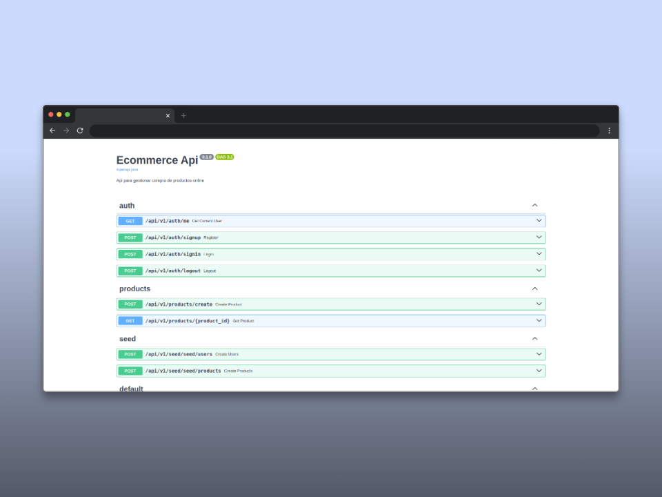
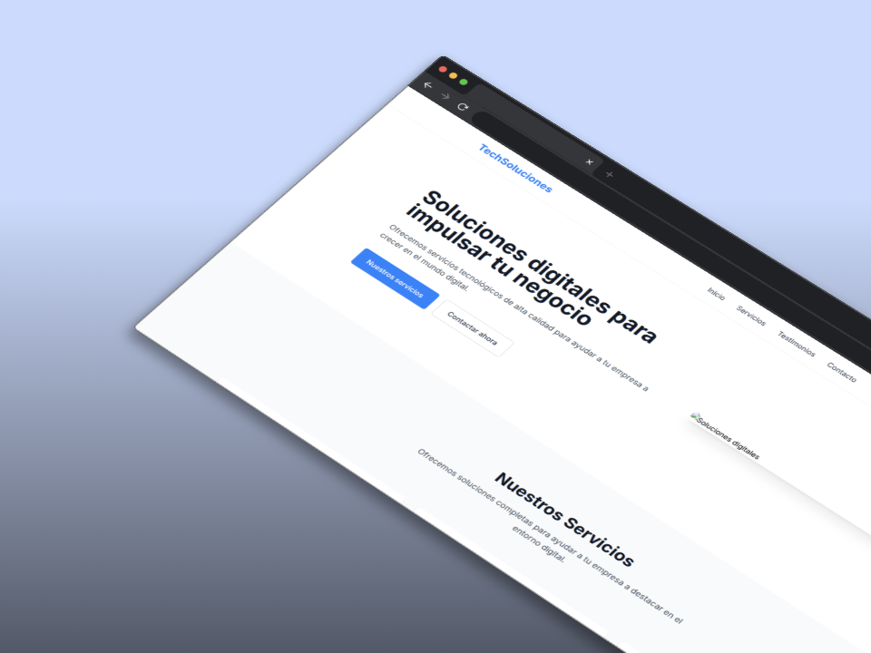
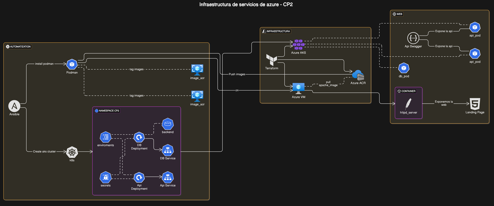

# Caso Practico 2: Entornos DevOps y Cloud

- Profesor: Joaquin Sergio Sosa Martin
- Fecha: 23/03/2025

# Integrantes: 🧑‍💼🧑‍💼🧑‍💼

- [Flavio Cesar Oria Pinto](https://github.com/flaviooria)

# Contenido del proyecto 📚

- Ansible [README.md](ansible/README.md)
- Terraform [README.md](terraform/README.md)

# Imágenes 📸

### UI Swagger API

### Landing Page 

### Diagrama de Arquitectura 
